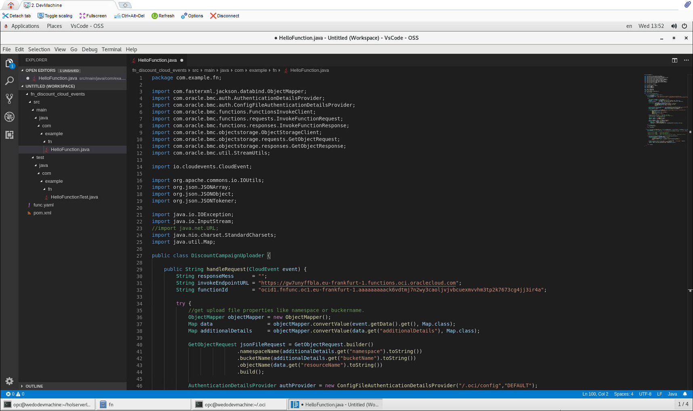
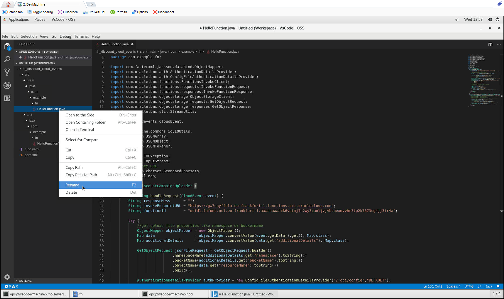
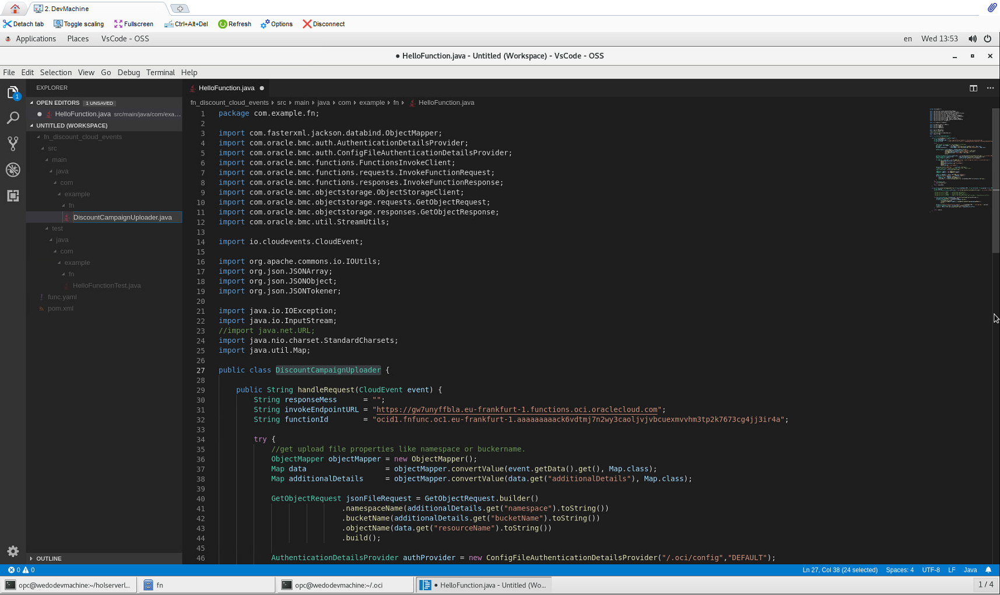
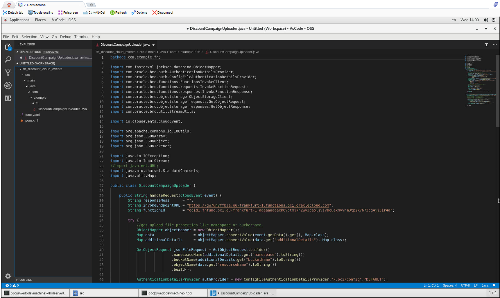

# Function fn discount upload
Verify that your cloud_events function has 2 files (func.yaml and pom.xml) and a **src** directory.

```sh 
cd fn_discount_cloud_events

ls -la
```


The serverless function should be created at ```src/main/java/com/example/fn/HelloFunction.java``` and you can review the example code with and your IDE or text editor. This file will be change in the next section.


A Junit textfile should be created at ```src/test/java/com/example/fn/HelloFunctionTest.java``` and used to test the serverless function before deploy it in OCI FaaS. We won't use Junit testing in this lab, but you could add some testing Junit file to your serverles function if you want.


## fn discount cloud-events IDE preparation
You could deploy this new serverless function in your FaaS environment, but the idea is to change the example code by the real function code. You can use a text editor or you favourite IDE software. In this lab we used Visual Studio Code (from the developer machine imagen in OCI marketplace), so all images was captured with that IDE, but you can use what you want.

Open Visual Studio Core (Applications -> Accessories in the development VM) or your favourite IDE 


Select **add workspace folder ...** in the Start Menu.


Click in HOME directory and next select the appropiate path to your function project directory [opc/holserverless/fn_discount_cloud_events]. Then click Add button to create a workspace from this directory in Visual Studio Core.


A new project will be available as workspace in the IDE


You can click n HelloFunction.java to review your serverless function code. Same for HelloFunctionTest.java file.


### fn discount cloud-events java code
The function code is in the next github [repository](https://github.com/oraclespainpresales/fn-pizza-discount-cloud-events). You can open it in other web brower tab, to review the project.

You can access java code to copy and paste it in your develpment machine IDE project. You could clone this github repository if you want, instead of copy and paste the different files. You see this second method (cloning the git repo) in the next functions sections.

You can copy the java function code creating a new file with the function name, in the fn directory or overwriting the code inside the HelloFunction.java function and next rename it (F2 or right button Rename). We show you both methods in the next sections, please choose one of them.

#### Creating new file
Create new file in ```/src/main/java/com/example/fn``` directory. Right mouse button and then New File.


Then set the same name as java class **[DiscountCampaignUploader.java]**


Now copy raw function code and paste it from the [java function code](https://raw.githubusercontent.com/oraclespainpresales/fn-pizza-discount-cloud-events/master/src/main/java/com/example/fn/DiscountCampaignUploader.java).


Delete HelloFunction.java and HelloFunctionTest.java from your IDE project.

#### Overwriting HelloFunction.java
You can overwrite the HelloFunction.java code with the DiscountCampaignUploader Function code.

Select the raw [java function code](https://raw.githubusercontent.com/oraclespainpresales/fn-pizza-discount-cloud-events/master/src/main/java/com/example/fn/DiscountCampaignUploader.java) from the repository and paste it overwriting the HelloFunction.java Function.



Click right mouse button in the HelloFunction.java file to Rename the file. You can press F2 key to rename the HelloFunction.java file as a shortcut.



Change the name of the java file to **[DiscountCampaignUploader.java]**.



You can delete the HelloFunctionTest.java file (and the test directory tree) or rename it and change the code to create your JUnit tests. In this lab we won't create JUnit test.



## Changing func.yaml file
You have to delete several files in the func.yaml code to create your custom Docker multi stage file. In you IDE select func.yaml file and delete next lines:

```
runtime: java
build_image: fnproject/fn-java-fdk-build:jdk11-1.0.105
run_image: fnproject/fn-java-fdk:jre11-1.0.105
cmd: com.example.fn.HelloFunction::handleRequest
```


## Overwriting pom.xml file
Next you must overwrite the example maven pom.xml file with the pom.xml content of the github function project. Maven is used to import all the dependencies and java classes needed to create your serverless function jar.


## Creating Multi Stage Dockerfile
You must create a new multi stage docker file, to deploy your serverless function as a docker image in your OCIR repository. This file must be created before deploying the function.

Select fn_discount_cloud_events folder in your IDE and create new file with [Dockerfile] name clicking right mouse button


Next copy from raw [Docker file code](https://raw.githubusercontent.com/oraclespainpresales/fn-pizza-discount-cloud-events/master/Dockerfile) to your new local Dockerfile file.


After that, click in File -> Save All in your IDE to save all changes.

## Code recap
You copy the function code and made several changes in the configuration files like func.yaml and pom.xml then you created a new Dockerfile to deploy the function. Now we'll explain this changes:

### DiscountCampaignUploader.java
Your function name is the same as main class and this class must have a public handleRequest method. String invokeEndpointURL and String functionId variables must be changed to call your [UploadDiscountCampaigns] function.
```java
Public class DiscountCampaignUploader {

    public String handleRequest(CloudEvent event) {
        String responseMess      = "";
        String invokeEndpointURL = "https://gw7unyffbla.eu-frankfurt-1.functions.oci.oraclecloud.com";
        String functionId        = "ocid1.fnfunc.oc1.eu-frankfurt-1.aaaaaaaaack6vdtmj7n2wy3caoljvjvbcuexmvvhm3tp2k7673cg4jj3ir4a";
```
Next is the code for cloud event trigger catch. After a cloud event trigger firing you'll must receive a cloud event similar to
```yaml
{
    "eventType" : "com.oraclecloud.objectstorage.createobject",
    "cloudEventsVersion" : "0.1",
    "eventTypeVersion" : "2.0",
    "source" : "ObjectStorage",
    "eventTime" : "2020-01-21T16:26:30.849Z",
    "contentType" : "application/json",
    "data" : {
      "compartmentId" : "ocid1.compartment.oc1..aaaaaaaatz2chvjiz4d3xdrtzmtxspkul",
      "compartmentName" : "DevOps",
      "resourceName" : "campaigns.json",
      "resourceId" : "/n/wedoinfra/b/bucket-gigis-pizza-discounts/o/campaigns.json",
      "availabilityDomain" : "FRA-AD-1",
      "additionalDetails" : {
        "bucketName" : "bucket-gigis-pizza-discounts",
        "archivalState" : "Available",
        "namespace" : "wedoinfra",
        "bucketId" : "ocid1.bucket.oc1.eu-frankfurt-1.aaaaaaaasndscagkbrqhfcrezkla6cqa2sippfq",
        "eTag" : "199f8dbf-0b8c-41b6-9596-4d2a6792d7e5"
      }
    },
    "eventID" : "3e47d127-19de-6eb8-eb67-0c1ab961fcbc",
    "extensions" : {
      "compartmentId" : "ocid1.compartment.oc1..aaaaaaaatz2chvjiz4d3xdrtzmtxspkul"
    }
}
```
this piece of code parse the cloudevent json description and get the important data like compartmentid, object storage name, bucket name or namespace.
```java
//get upload file properties like namespace or buckername.
            ObjectMapper objectMapper = new ObjectMapper();
            Map data                  = objectMapper.convertValue(event.getData().get(), Map.class);
            Map additionalDetails     = objectMapper.convertValue(data.get("additionalDetails"), Map.class);

            GetObjectRequest jsonFileRequest = GetObjectRequest.builder()
                            .namespaceName(additionalDetails.get("namespace").toString())
                            .bucketName(additionalDetails.get("bucketName").toString())
                            .objectName(data.get("resourceName").toString())
                            .build();
```
That relevant data will be use to access (with authProvider) to the object storage and get the campaign.json file.
```java
AuthenticationDetailsProvider authProvider = new ConfigFileAuthenticationDetailsProvider("/.oci/config","DEFAULT");
            ObjectStorageClient objStoreClient         = ObjectStorageClient.builder().build(authProvider);
            GetObjectResponse jsonFile                 = objStoreClient.getObject(jsonFileRequest);

            StringBuilder jsonfileUrl = new StringBuilder("https://objectstorage.eu-frankfurt-1.oraclecloud.com/n/")
                    .append(additionalDetails.get("namespace"))
                    .append("/b/")
                    .append(additionalDetails.get("bucketName"))
                    .append("/o/")
                    .append(data.get("resourceName"));

            System.out.println("JSON FILE:: " + jsonfileUrl.toString());
            //InputStream isJson = new URL(jsonfileUrl.toString()).openStream();
            InputStream isJson = jsonFile.getInputStream();

            JSONTokener tokener = new JSONTokener(isJson);
			JSONObject joResult = new JSONObject(tokener);

            JSONArray campaigns = joResult.getJSONArray("campaigns");
            System.out.println("Campaigns:: " + campaigns.length());
			for (int i = 0; i < campaigns.length(); i++) {
                JSONObject obj = campaigns.getJSONObject(i);
                responseMess += invokeCreateCampaingFunction (invokeEndpointURL,functionId,obj.toString());
            }
```
			 


### func.yaml

```yaml
schema_version: 20180708
name: fn_discount_cloud_events
version: 0.0.1
```
You must have deleted this 4 lines to create your customized Dockerfile. This lines are using to setup the default deploy fn docker images for java.
```
runtime: java
build_image: fnproject/fn-java-fdk-build:jdk11-1.0.105
run_image: fnproject/fn-java-fdk:jre11-1.0.105
cmd: com.example.fn.HelloFunction::handleRequest
```
Last line is the entry point to execute the function. Represent the path to the funcion name and handleRequest public method and you can find it in the new Dockerfile as CMD command.
```
cmd: com.example.fn.HelloFunction::handleRequest
```
### pom.xml

### Dockerfile

## Deploy fn discount cloud-events function
To deploy your serverless function you must execute next command with ```--verbose``` option to get all the information about the deploy process.
```sh
fn --verbose deploy --app gigis-serverless-hol
```
