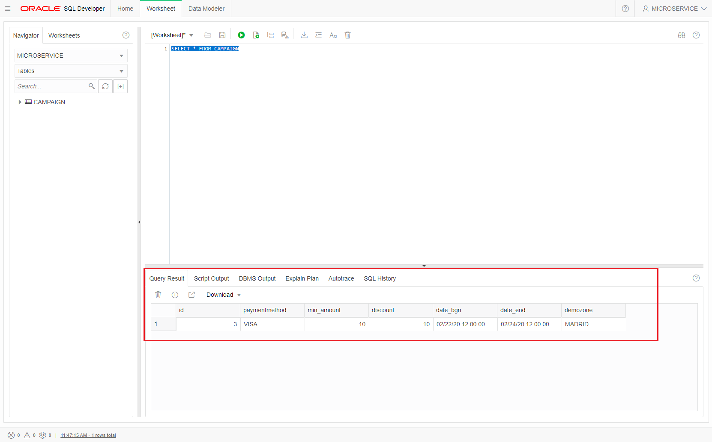

# Serverless Application Execution
Now that you have created and configured all the serverless functions, you will test it.

You test each function step by step to complete the app execution.
First function will be the **cloud event** function. To test this function you have to create a json file with the discount campaigns. This campaign file has next json format:
```json
{
  "campaigns": [
    {
    "demozone": "MADRID",
    "paymentmethod": "VISA",
    "date_bgn": "2020-03-01T00:00:00Z",
    "date_end": "2020-03-05T00:00:00Z",
    "min_amount": "15",
    "discount": "10"
    },
    {
    "demozone": "MADRID",
    "paymentmethod": "AMEX",
    "date_bgn": "2020-03-15T00:00:00Z",
    "date_end": "2020-03-20T00:00:00Z",
    "min_amount": "10",
    "discount": "10"
    }
  ]
}
```
As you can see the file contain a campaign array and each campaign consists of: 
- demozone: a demozone or region to apply the discount (MADRID, MALAGA, TOKYO, MUMBAY, SAN_FRANCISCO...)
- paymentmethod: VISA, MASTERCARD, AMEX, CASH
- date_bgn: inital date for applay the discount
- date_end: final date to apply the discount
- min_amount: the min amount to apply the discount
- discount: % of discount.

Create a campaign file in your favourite text editor (or [atom](https://atom.io/) for example)


Remember that you created an Object Storage bucket in OCI to store campaigns files and you enabled the cloud event check. 


Select your Bucket and check that your are in your right compartment.


Upload the previous created campaigns json file to your bucket. click in Upload Objects button.


Drag and drop your campaign.json file in Drop Files square and check that the file was uploaded. Then Click **Upload Objects** button


A new file should be showed in your bucket.


Next go to your ATP DB Service Console and Development -> SQL Developer Console. You could use the SQL Developer URL as you used before.

```html
https://<your-ATP-instance>.adb.<your_region>.oraclecloudapps.com/ords/atp/_sdw/?nav=worksheet
```
Introduce your user [MICROSERVICE] and your user password [AAZZ__welcomedevops123]


Check that your Schema is MICROSERVICE and the table CAMPAIGN is showed.


Then execute next SQL Query 
```sql 
SELECT *  FROM CAMPAIGN
``` 
Review the new campaigns inserted from the json file and functions (cloud_event and upload) automatically.



You could trace your cloud_events and upload functions with OCI Logging service or papertrail as you read in logging configuration sections. 


The first time the function executes, it will take a while due to the cold start time. Next executions must take less time.


Now that you have inserted one Discount Campaign, you have to test fn_discount_campaign Function. Open a terminal in your development machine go to your fn_discount_campaign path [$HOME/holserverless/fn_discount_campaign] and execute next command:
```sh
echo -n '{"demozone":"madrid","paymentMethod":"visa","pizzaPrice":"21"}' | fn invoke gigis-serverless-hol fn_discount_campaign
```
Check that you have received a new value with a discount and then execute again
```sh
echo -n '{"demozone":"madrid","paymentMethod":"amex","pizzaPrice":"21"}' | fn invoke gigis-serverless-hol fn_discount_campaign
```
Check that you haven't received any discount.


Review you papertrail log to see the function logging.


Finally you can check the whole serverless app metrics. Click in the serverless app name [gigis-serverless-hol] and **Metrics** menu to review all serverless app function executions and durations.


# Continue with Optional DevCS and pipelines part or finish the HOL.

* [FaaS and Developer Cloud Service](https://github.com/oraclespainpresales/GigisPizzaHOL/blob/master/devcs2fn.md)
* [Gigi's serverless HOL](https://github.com/oraclespainpresales/GigisPizzaHOL/blob/master/gigis-serverless-HOL.md)


