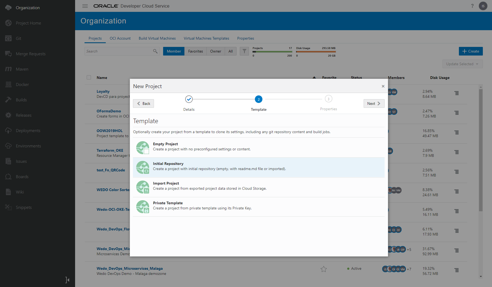
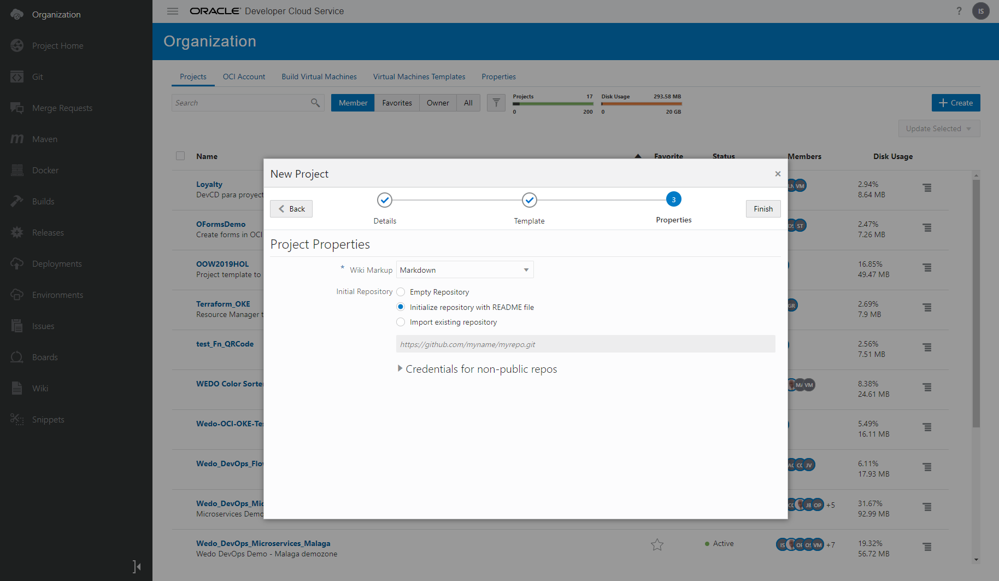
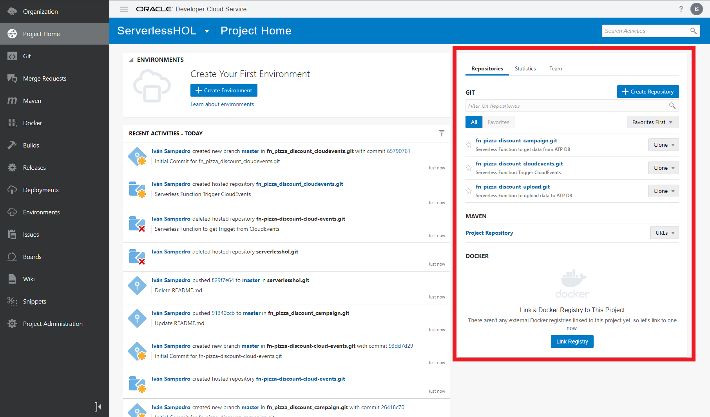

[](https://www.oracle.com/code-one/)

# Gigi's Discount Campaigns - Serverless HOL
This HOL is based in a Demo developed by WeDo Team as part of an innovation initiative to approach Oracle Cloud Solutions by providing practical examples that could be “touched” and easily understood.

Demo is known as Gigi’s Pizza. This Use Case is focused in serverless (fn) and Autonomous DataBase. In Gigi's Pizza demo we have three microservices coded in different languages like nodejs and of course Java (Helidon framework). This three microservices are part of a delivery pizza app, one microservice controls the orders, other one controls the pizza delivery and the last one controls the accounting. 


In the first demo version, we had one serverless function that got you a pizza price discount acording to a basic bussiness rule, if the pizza price was between 10$ - 15$ you receive discount of 1%, if the pizza price was between 15$ - 19$ you receive 2% and if the pizza price was over 19$ you receive a 2% discount. It was very interesting to show a basic serverless function and graalvm compiler, but the idea is to show more about serverless. Now we show you a more elavorated serverless app and you can touch it an modify the code as you want.


This serverless Hands On Lab includes:

* Oracle ATP - Autonomous Transaction Processing - Autonomous Database as main repository.
* Oracle ORDS (REST) access to ATP using serverless Functions.
* Oracle JDBC access to ATP using serverless Functions.
* Oracle Cloud Infrastructure - Object Storage to upload json files with discount campaigns.
* CloudEvents to trigger this json files and upload them to the ATP.
* Oracle managed Functions (serverless fn based) to upload data, get data and send it to microservices.

# In this Hands on Lab

In this HOL you will create a serverless app for discount campaigns. 
You will:

- Create and Configure an **ATP (Autonomous Database)** to store the discount campaign.
- Create an **OCI Object Storage** to upload the json files.
- Create a **CloudEvents** trigger to upload automatically the campaigns to ATP.
- Create a discount campaign **json file** like this:

```yaml
{
  "campaigns": [
    {
    "demozone": 'MADRID',
    "paymentmethod": "VISA",
    "date_bgn": "2020-01-21T00:00:00Z",
    "date_end": "2020-01-22T00:00:00Z",
    "min_amount": "15",
    "discount": "10"
    },
    {
    "demozone": "MADRID",
    "paymentmethod": "AMEX",
    "date_bgn": "2020-01-21T00:00:00Z",
    "date_end": "2020-01-22T00:00:00Z",
    "min_amount": "7",
    "discount": "10"
    }
  ]
}
```

- Create **2 serverless Functions** to capture the event, process the file and upload the data to ATP PDB.
- Create **1 serverless Function** to get the discount amount for a pizza order

All the code project will be stored in a GIT repo in Developer Cloud Service. If you attend our previous HOL about Gigi's pizza, you had created a DevCS instance with the Gigi's project copied on it. You can use that DevCS instance and the same Gigi's project to this lab. You can continue in <meter paso> step.

If you don't have any Oracle Cloud Account or DevCS instance you could create one following the first steps of the LAB to create them. After creating the DevCS instance you must create a new project to continue with the lab.

## Summary

[<span class="underline">Setting up an Oracle Cloud Account</span>](#setting-up-an-oracle-cloud-account)

[<span class="underline">Getting key config data from Oracle Cloud Tenancy</span>](#getting-key-config-data-from-oracle-cloud-tenancy)

[<span class="underline">How to get OCI tenancy config data to configure DevCS</span>](#how-to-get-oci-tenancy-config-data-to-configure-devcs)

[<span class="underline">Configuring a Developer Cloud Service Instance</span>](#configuring-a-developer-cloud-service-instance)

[<span class="underline">Virtual Machines Template configuration in DevCS</span>](#virtual-machines-template-configuration-in-devcs)

[<span class="underline">Build Virtual Machines configuration in DevCS</span>](#build-virtual-machines-configuration-in-devcs)

[<span class="underline">Create New Project in DevCS</span>](#create-new-project-in-devcs)

[<span class="underline">Create GIT Repositories</span>](#create-git-repositories)

[<span class="underline">Create Development Environment Machine</span>](#create-development-environment-machine)

# **Setting up an Oracle Cloud Account**

As an attendee to OOW/CodeOne 19 you have been provided with access to a free trial account part of Free Oracle Cloud Program with 500$ / 30 days trial. This trial is associated with the email address you used to register to event.

Go to [<span class="underline">http://cloud.oracle.com</span>](http://cloud.oracle.com) and click in the “Try for Free” button in the top right:


Then enter your email address and select your Country/Territory:


The system will detect that your email address has been whitelisted as Oracle attendee and you will be offered a free trial with no need to use a credit card or sms. Trial offered is for 500$ for 30 days.


Fill in required fields. For account type, select “Personal Use”. Select a name for your trial tenancy, a region and the rest of details:


Then enter a password required to authenticate in your tenancy when provisioned. Remember password has to be longer than 12 character and including at least an upper character and a special character:


Accept the Terms and Conditions:


And you will be redirected to the initial page or Oracle Cloud Infrastructure to authenticate for the first time in your tenancy:


Enter your user and password just created:


And you will be directed to initial Oracle Cloud Infrastructure Dashboard (referred from now on as OCI Dashboard):


Click in the hamburger icon on the top left side and menu will be shown. There select Platform Services (under More Oracle Cloud Services” Area)-\> Developer menu option.


There you will be taken to Developer Cloud Service Welcome Page. Let’s start creating a DevCS instance. Click in Create Instance.


In next screen provide an Instance Name and fill in also Region you want to create your instance, then click in Next Button:


Check the selections in previous screen an click in Create button:


Instance creation starts creating service as you can see in Status screen:


This process will take some time so let’s take advantage of time while this process ends, and we can then configure the Developer Cloud Service Instance.

# **Getting key config data from Oracle Cloud Tenancy**

Now before we are able to configure a Developer Cloud Service Instance, let’s gather some key info about our OCI tenancy that will be required throughout the whole lab. So we recommend you to create a txt file where you store this basic info you will be required to use several times during this lab:

  - Tenancy OCID
  - User OCID
  - Private Key
  - Public Key
  - Fingerprint
  - Auth Token
  - Compartment OCID
  - Object Storage Namespace

## How to get OCI tenancy config data to configure DevCS

In Oracle Cloud Infrastructure interface menu, go to Administration-\>Tenancy Details:


In Tenancy information area, select copy button so that you copy the OCID for tenancy and don’t forget to make a note in a txt file.

Also copy the Object Storage Namespace under the Object Storage Setting area and don’t forget to make a note in a text file.


Now go to Menu option Identity-\>Users:


In Users area, click on copy button for your email address user(remember this user has admin role in OCI tenancy) so that you can copy the user’s OCID. Don’t forget to make a note in a txt file.


Now we will create an Auth token for the user by using a public and private key. We will provide you with two already created .pem keys to download in:

[<span class="underline">https://github.com/oraclespainpresales/GigisPizzaHOL/tree/master/Credentials</span>](https://github.com/oraclespainpresales/GigisPizzaHOL/tree/master/Credentials)

First thing you need to do is viewing content of Private Key and copying private key, making a note in a txt file. Then do the same with public key and copy content into clipboard.


Now click in your email user and you will be directed to a details screen, where you must click in Api Keys area in “Add Public Key”
button.


Now paste in popup window the Public Key previously copied in clipboard. Make sure you have copied public.pem content and not private.pem content. Click in Add button.


Now copy Fingerprint generated as it will be used later. Don’t forget to make a note in a txt file.


Now create parameter required (AuthToken) by clicking in Auth Tokens under Resources area, clicking in Generate Token button and then
providing a description:

IMPORTANT REMINDER: AFTER YOU CLICK IN Generate Token Button, COPY THIS AUTHTOKEN AND KEEP SAFE AS IT CANNOT BE FOUND LATER


IMPORTANT: Copy the Generated Token in a txt file and keep safe as we will require it later:


Now we have to create a new Compartment as currently we only have the root one in tenancy by default. In OCI Dashboard Menu go to
Identity-\>Compartments 


Click on “Create Compartment” button and fill in Name(we have called it
HandsOnLab), Description and Parent Compartment(it must be root referred
with Tenancy name) and click in “Create Compartment” button:


Now click in Compartment name you have just created (HandOnLab for me):


And click on copy link to copy the Compartment OCID. Don’t forget to make a note in a txt file.


This concludes the list of OCI tenancy parameters you will require to run next section.

# **Configuring a Developer Cloud Service Instance**

Now let’s check that Developer Cloud Service has been created so that we can configure it.

Check updated status by clicking in  icon:


Once the Developer Cloud Service instance has been provisioned, click on the right side menu and select: “Access Service Instance”:


You will see next screen where you are requested to run some extra configurations related with Compute & Storage. Click in OCI Credentials link in Message and have close to you the txt file with OCI information previously gathered:


Select OCI for Account type and fill in the rest of the fields. Leave passphrase blank and also check the box below.

Then click on validate button and if compute and storage connections are correct, then click on Save button.


## Virtual Machines Template configuration in DevCS

Now we need to configure one or two VM servers to be able to build your project developments. We will create a VM Build Server to be used to compile and Build Microservices components and another to compile and Build Fn Function (Serverless) components that will require a different set of Software components:


To do this, we have to create a first virtual Machine Template to be used with Microservices, so click in Virtual Machines Templates tab:


Now click on Create button:


Provide a Name(like VM\_basic\_Template) and select Oracle Linux 7 as Platform:


Now Click in Configure Software button:


Now select the mínimum Software packages will will require later to build our project. If you remember from Introduction section, we will build microservices developed with Node JS v8 and Java . We will also require to access to OCI so OCICli will be required and thus Python will be also needed. Then we will have to build Docker images and also deploy those images in a Kubernetes Cluster thus KUBECtl will be needed too. Finally we also need the Minimum required Build VM components. So mark software components options below:

  - Docker 17.12
  - Kubectl
  - Node.js 8
  - OCIcli
  - Python 3.3.6
  - Required Build VM Components


Click in Done button and we will have finally our VM template created like below:


Now we will create a second Virtual Machine Template for Serverless Components. Click in Create Template again and fill in fields and click on Create button:


Now we will select specific Software components required for Fn Function build process. Click in Configure Software button:


Now configure software components. Fn 0 will have to be selected together with Docker, OCIcli, Kubectl, Python and required build VM
components. No Node JS and Java components this time required:


Click on Done and these are the software components in VM template:


## Build Virtual Machines configuration in DevCS

Now we have to create a couple of real VM in OCI based in Virtual Machine template just created. So, we will select Build Virtual Machines Tab and will click on Create button:


Now Select 1 as quantity, select the previously created template, your region and finally select as Shape the option VM.Standard.E2.2:


Now your VM will start creation process


It is important to modify to Sleep Timeout a recommend value of300 minutes (basically longer than lab duration) so that once started, the build server won’t automatically enter into sleep mode.


And now we will create following the same process a second Build Virtual machine using the Fn Function defined template:


IMPORTANT NOTE: At this point try to manually start both VM Servers like in screenshot below:


And check that Status changes to starting in both servers:


## Create New Project in DevCS
Now that you have created the environment connection to OCI and Build Machines, you must create a new project. This project will contain all the source code files in the GIT repository and the jobs and pipelines to CI/CD.

To create a new DevCS project click on Project Home menu and then click on +Create Button. Next introduce a representative name (ServerlessHOL for example) and optionally a Project Description. Select Private (Shared if you want your project accesible from external teams) and Preferred Language for the project. Then click Next button.


Select Empty Project and Click Next button.



Click Finish to create the new project.



Wait to project environment creation (about 2 or 3 minutes)


## Create GIT Repositories
You have now a new empty project created. Now we are going to create 3 GIT reporsitories, one for each serverless function.
To create a new GIT repo go to Project Home menu and click on Create Repository button. Next you write **fn_pizza_discount_upoload** as GIT name and optionally a Description. Then click Create button.


New GIT repo will be created with a README.md file only.


Repeat again to create 2 new GIT repos:
* **fn_pizza_discount_campaign**
* **fn_pizza_discount_cloudevents**

Check that you have three GIT repositories in the main project menu.



## Create Development Environment Machine
This is an optional step. We recomend a linux development machine, but you can use Windows too.
Check that you have installed next development resources and applications:

- IDE software
- Fn cli
- OCI cli
- OCI user Api Key and Auth Token credentials to access OCIR (Docker Registry)

Make sure you've setup your OCI API signing key and Auth Token (for OCIR access), installed the Fn CLI, completed the CLI configuration steps and have setup the OCI Registry you want to use.

### API signing key and Auth Token
You had created it before, when you was setting up the Developer Cloud Environment. If you didn't create the Api Key and Auth Token credentials you must follow next steps:

[<span class="underline">How to get OCI tenancy config data to configure DevCS</span>](#how-to-get-oci-tenancy-config-data-to-configure-devcs)

### Fn Cli Installation
#### Linux
```sh
curl -LSs https://raw.githubusercontent.com/fnproject/cli/master/install | sh
```
#### Windows
You must download de fn.exe file from fn github public [repository](https://github.com/fnproject/cli/releases)

### OCI cli installation and Configuration
```sh
oci setup config
```


Keep your txt file with your OCI Tenancy parameters close as you will be asked for those parameters. Before starting, please copy into the VM the private key previously provided:


Decline to generate a new RSA key pair, copy your private key previously provided into you environmet machine. We recommend you to paste it into this path:
```sh
/home/holouser/.oci
```


