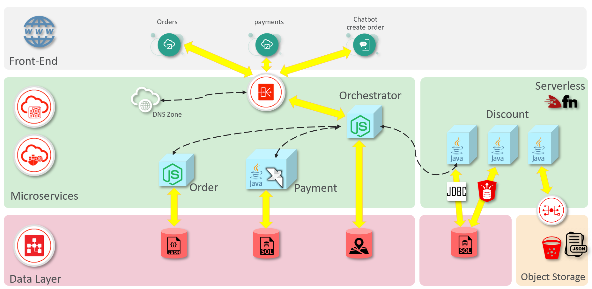

Coming Soon!
# Conecting Microservices to Severless Function with API Gateway
Once you have finished the microservices HOL and the serverless HOL, you might have a architecure quite similar to next figure.

As you can see there isn't any connection or call from microservice orchestrator to the new discount campaign serverless app or serverless function. You might have connected the old serverless function to your microservice orchestrator, but the idea is that you could use the new serverless app.

To connect your microservice orchestrator to the new serverless app, you'll use [OCI api gateway service](https://docs.cloud.oracle.com/es-ww/iaas/Content/APIGateway/Concepts/apigatewayoverview.htm). Following next HOL you'll can create an API Gateway in OCI to invoke your calculate discount serverless function from microservice orchestrator in a simple way.

If you review the orchestrator nodejs code you can see that a direct serverless function invoke is a little tricky, because you must create an access file with your credentials, OCI tenancy, OCI comparment and so. You must read this file, create a context and invoke the serverless function. All this task are simplfied using an API Gateway and you improve security as you don't have to create text plain config files included in your docker image for example.

The Api Gateway let you more configuration options and more management improves. The idea is at the end of this HOL you have an architecture similar to that:

Lets create an OCI Api Gateway!

## OCI Api Gateway Creation.
